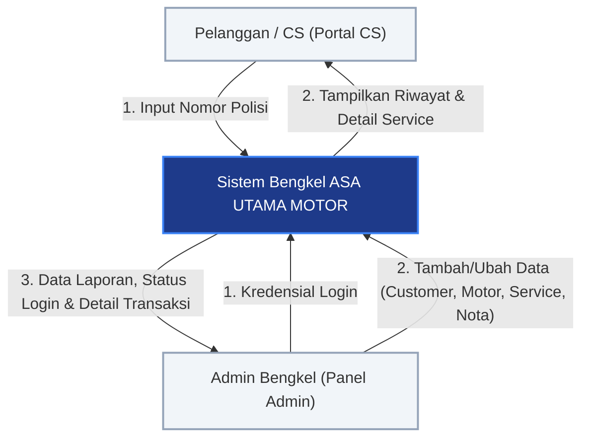
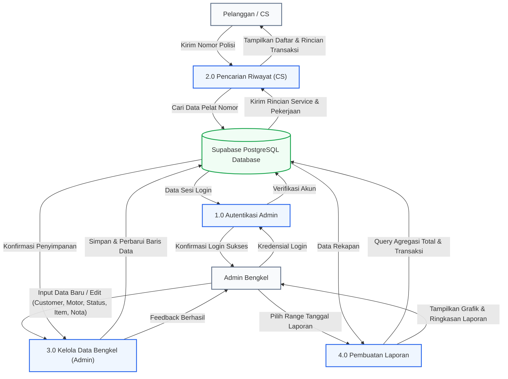
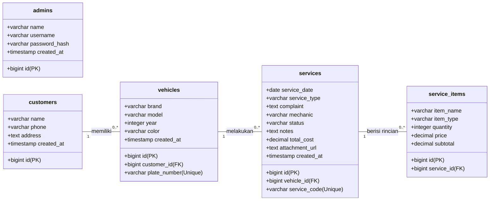
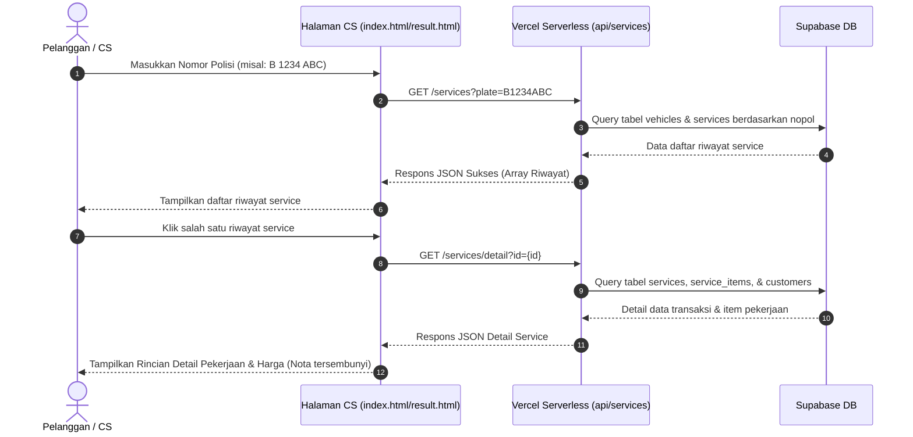
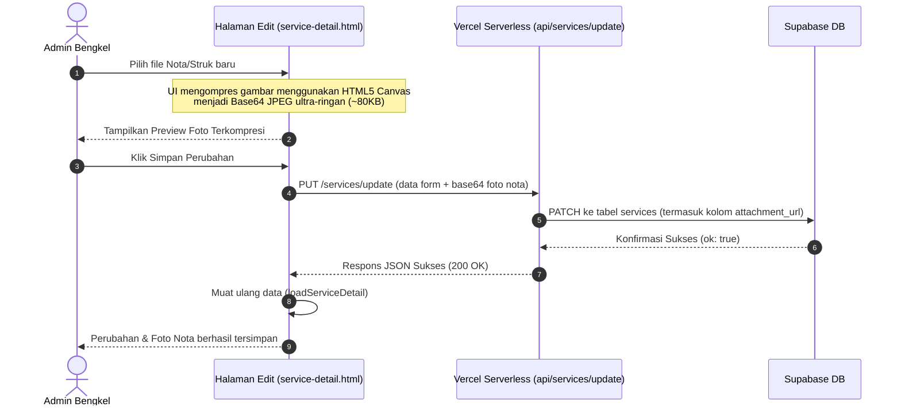

# DFD & UML Diagram - ASA UTAMA MOTOR

Dokumen ini berisi Diagram Alir Data (DFD) dan UML Diagram dari sistem informasi bengkel **ASA UTAMA MOTOR** yang saat ini berjalan.

---

## 1. Data Flow Diagram (DFD)

### Level 0: Context Diagram
Context diagram menunjukkan batas sistem dan entitas eksternal (Pelanggan/CS dan Admin) yang berinteraksi dengan sistem.

---

### Level 1: DFD Diagram
DFD Level 1 merincikan proses utama di dalam sistem beserta penyimpanan datanya (*data store*).

---

## 2. UML Diagram

### Class / Database Schema Diagram
Diagram kelas ini menggambarkan tabel database PostgreSQL Supabase serta relasi (*foreign key*) antar tabel.

---

### Sequence Diagram: Proses Pencarian Pelanggan (CS View)
Diagram urutan ini menunjukkan interaksi dari pencarian nomor polisi sampai data detail dimuat.

---

### Sequence Diagram: Proses Tambah/Edit Data & Unggah Nota (Admin Panel)
Diagram urutan ini menunjukkan proses ketika admin memperbarui status dan melampirkan foto nota terkompresi.

